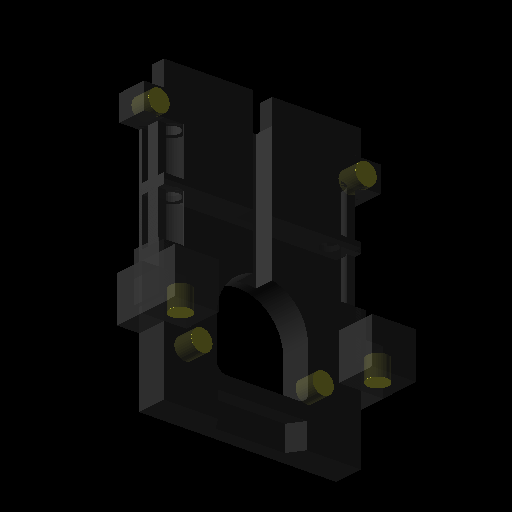
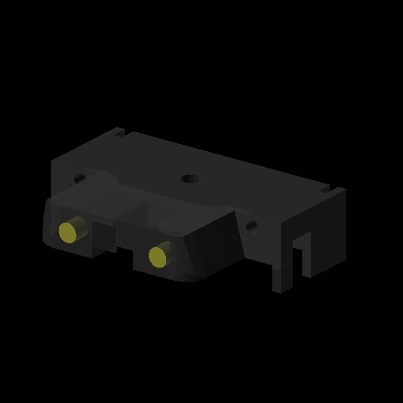
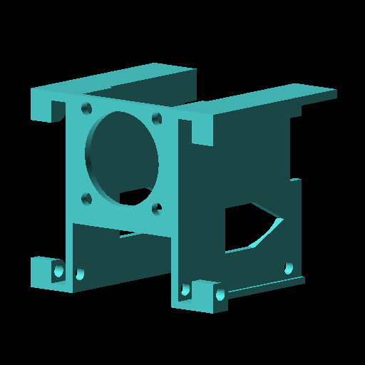
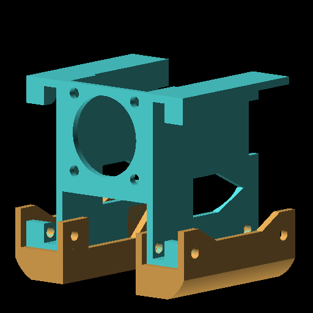
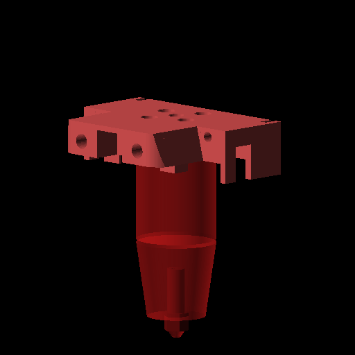
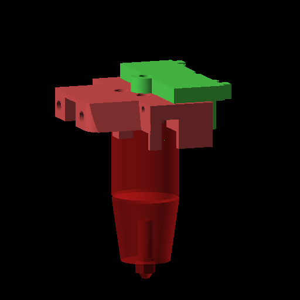

# Assembly

**This is WORK-IN-PROGRESS**

## Initial Assembly

### Prereqs
- Install heatsets into carriage and hotend mount
   1. 
   2. 
- If needed, install additional heatsets into variants
- Install 2x M3x30 pins into the carriage, from the top

### Housing
1. 
   - Push 4010 fan cables through the slot in the housing
   - The fans will mostly press-fit in place. Ensure the open side of the fan is facing down, with the arrow pointing away from the side of the housing that's solid.
2. 
   - Slide the ducts over the housing and 4010 fans
3. Put 2x M3x16 into each duct, with the bolts going through the holes in the fan
   - **These screw into plastic, be gentle**
4. Press the 2510 fan into the front of the housing

### Hotend/extruder
1. 
   - Bolt the hotend to the hotend mount. Try to make the cables face towards the back to make cable routing easier
2. 
   - Bolt the extruder to the extruder mount, and then press-fit it onto the hotend mount

### Carriage
1. Assemble your probe, and attach it to the probe mount
2. Pull your belts, and push them through the slots on the carriage.
   1. The belts will go around the M3 pins, and come out the other side.
   2. After putting all 4 belts through, bolt the carriage mount onto the linear rail, and pull the belts tight
3. Attach the probe mount to the carriage

### Bring it together
1. Attach the housing to the carriage, put 2x M3x8 bolts through the housing brace, through the housing, and into the 2x heatsets in the carriage
   - It may help to lightly thread the bolts through the brace and into the housing prior to trying to attach to the carriage
2. Press the hotend/extruder mounts onto the top of the housing. Route the fan cables to either side through the holes in the hotend mount
3. Put the two M3x30 bolts through the hotend mount, through the extruder mount, and into the 2 heatsets on the carriage
4. Run the hotend cable through the hole near the bottom of the carriage, and up the channel towards the extruder
5. Attach the faceplate

## Swapping parts
- Swap/Reprint fan housing
  1. Release fan wires
  2. Undo 2x M3 bolts
  3. Pull fan housing off
- Swap/reprint hotend
  1. Release hotend wires
  2. Undo 2x M3 bolts
  3. Lift extruder out of the way
  4. Pull hotend out
