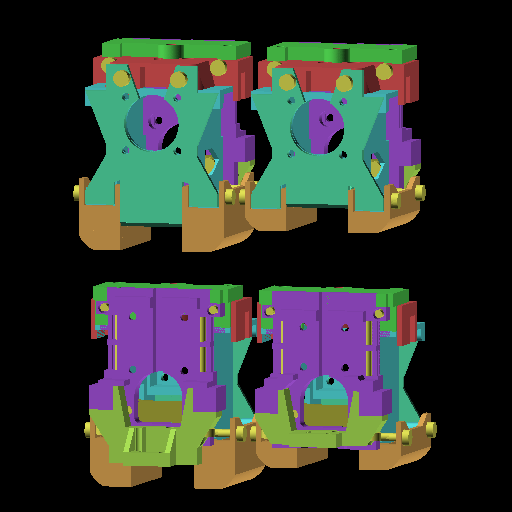
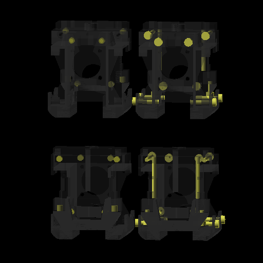
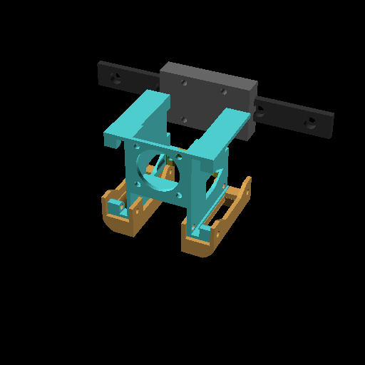
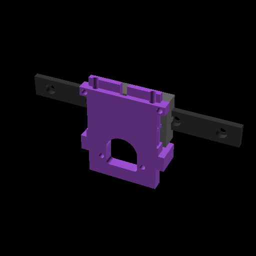
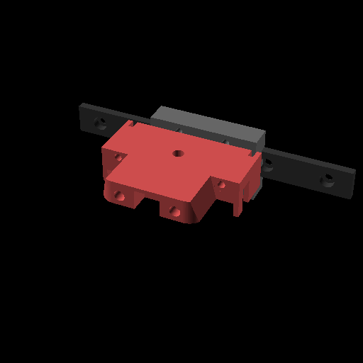
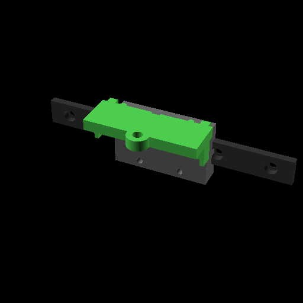
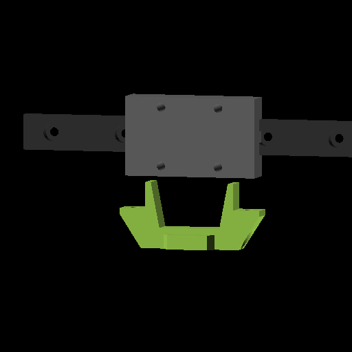
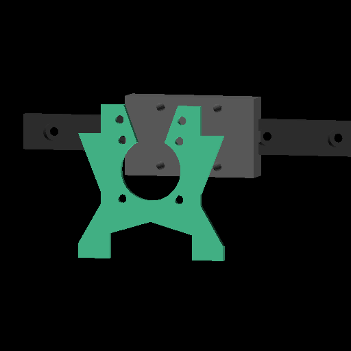

# XestBurner
A light modular toolhead designed in OpenSCAD

**This is WORK-IN-PROGRESS**

## Links
- [Description](#description)
- [BOM](#bom)
- [STLs](#stls)
- [Assembly Guide](ASSEMBLY.md)

## Description
XestBurner is meant to be as small as possible, maximizing available print space, while also being modular and allowing components to be switched with minimal tweaks to the toolhead.

XestBurner works with HF (standard, v6) hotends, and UHF (volcano) hotends.

The HF variant measures 61x53x67 (width (x)/depth (y)/height (z)).

### Why?
This toolhead was heavily inspired by the amazing work done for  [Xol](https://github.com/Armchair-Heavy-Industries/Xol-Toolhead), and [Dragonburner](https://github.com/chirpy2605/voron/tree/main/V0/Dragon_Burner)

I switched to a CHUBE hotend, and found that none of the current toolheads supported it, along with features that are necessary, like ease-of-assembly, modular components, and being light.

This toolhead was designed around having a similar footprint to DragonBurner, supporting CHUBE (and other large hotends), and using only M3 hardware.

## BOM

- Prints:
  - Housing
  - Housing Brace
  - Ducts (HF or UHF)
  - [Carriage mount](#carriage)
  - [Hotend mount](#hotend)
  - [Extruder mount](#extruder)
  - [Probe mount](#probe)
  - [Faceplate](#faceplate)
- Hardware:
  - 2x 4010 fans (sides of housing)
  - 1x 2510 fan (front of housing)
  - 8x M3x4x5 (Voron) heatsets
    - 6x for carriage, 2 for housing brace, 2 for hotend/extruder, 2 for probe
    - 2x for hotend mount
  - 2x M3x30 pins (inside the carriage for belts)
  - 2x SHCS/BHCS M3x6 (faceplate, into 2x heatsets on the hotend mount)
    - M3x8 probably works
  - 6x SHCS/BHCS M3x8
    - 4x: faceplate, into 2510 fan
    - 2x: probe mount, into 2x heatsets on the bottom of the carriage
  - 4x SHCS M3x16 (housing ducts, through the 4010 fans)
  - 2x SHCS M3x30 (hotend mount, into 2x heatsets on the front of the carriage)
- Variants
  - Carriage
    - MGN12H
      - 4x SHCS M3x8 (?)
    - MGN9H
      - 4x SHCS M3x8 (?)
  - Extruder
    - Sherpa Mini
      - 2x M3x4x5 heatsets
      - 2x SHCS M3x8 (?)
  - Probe
    - Klicky PCB
      - 3x M2.5 heatsets

## STLs
### Base

- [Housing](XestBurner/STLs/XB-housing.stl)
- [Housing: Brace](XestBurner/STLs/XB-housing_brace.stl)
- Ducts:
  - [HF](XestBurner/STLs/XB-ducts-hf.stl)
  - [UHF](XestBurner/STLs/XB-ducts-uhf.stl)

### Carriage

- [MGN9H](XestBurner/STLs/XB-carriage_MGN9.stl)
- [MGN12H](XestBurner/STLs/XB-carriage_MGN12.stl)

### Hotend

- [Phaetus Rapido](XestBurner/STLs/XB-hotend_phaetus-rapido.stl)
- [Chube](XestBurner/STLs/XB-hotend_chube.stl)
- [Phaetus Dragonfly BMO](XestBurner/STLs/XB-hotend_phaetus-dragonfly-bmo.stl)

### Extruder

- [Sherpa Mini](XestBurner/STLs/XB-extruder_sherpa-mini.stl)

### Probe

#### HF
- [Klicky PCB](XestBurner/STLs/XB-probe-hf_klicky-pcb.stl)
#### UHF
- [Klicky PCB](XestBurner/STLs/XB-probe-uhf_klicky-pcb.stl)

### Faceplate

- [Standard](XestBurner/STLs/XB-faceplate.stl)
#### HF
- [LEDs](XestBurner/STLs/XB-faceplate-hf_led.stl)
- [LEDs and nozzle cam](XestBurner/STLs/XB-faceplate-hf_led_cam.stl)
#### UHF
- [LEDs](XestBurner/STLs/XB-faceplate-uhf_led.stl)
- [LEDs and nozzle cam](XestBurner/STLs/XB-faceplate-uhf_led_cam.stl)

## Development
### Export STLs
- run `python3 scadboil/run.py -p XestBurner -a export`
### Export images
- run `python3 scadboil/run.py -p XestBurner -a image`
